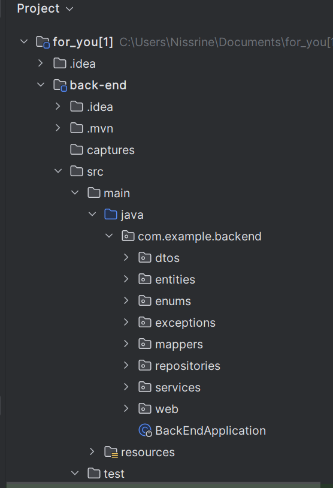
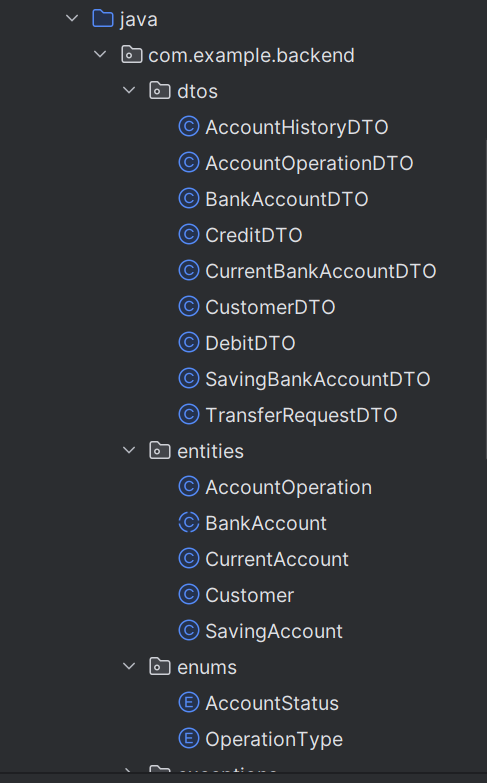
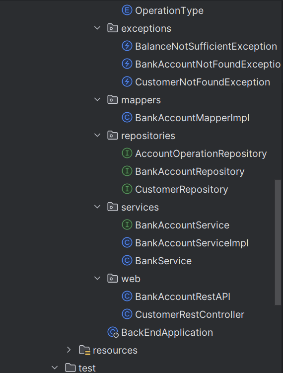
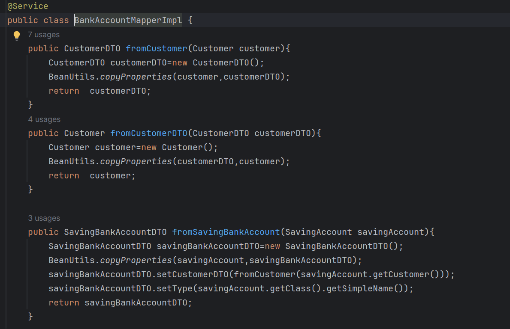
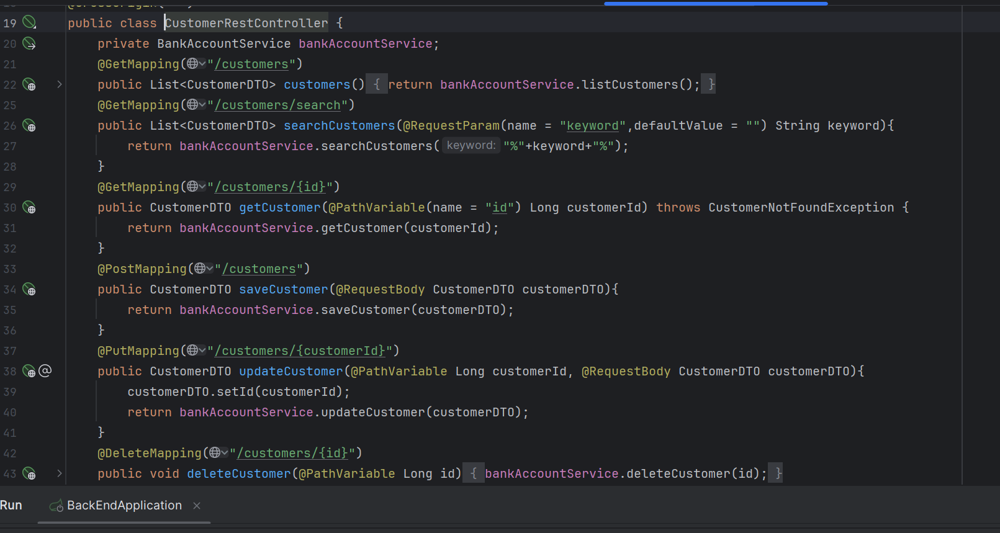
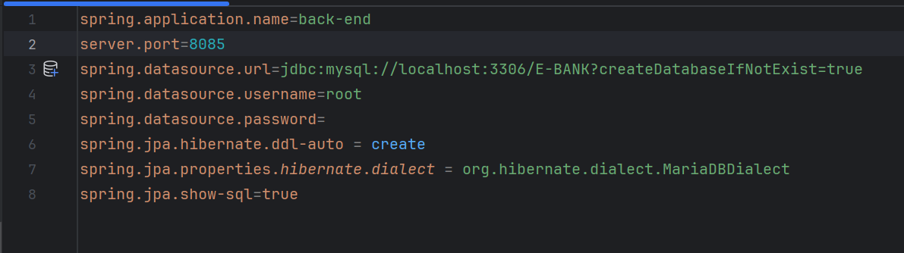
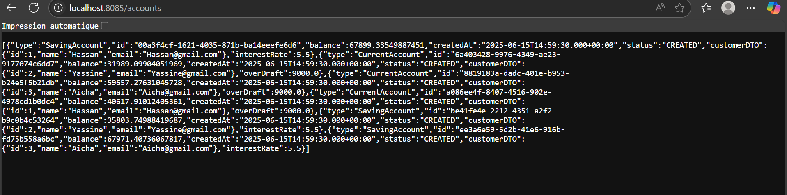
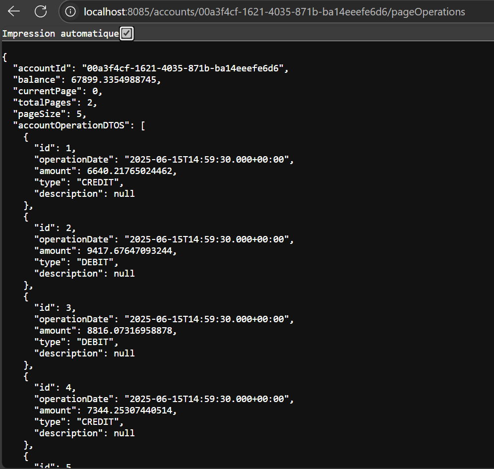
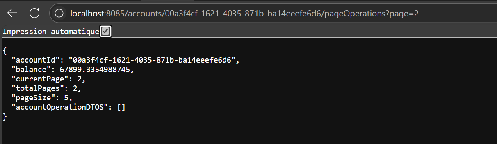

<h2>Backend du projet e-banking</h2>
<h4>Architecture </h4>

<h4>BankAccountService implémentation(service)</h4>

<h4>Contrôleurs REST (BankAccountRestAPI, CustomerRestController)</h4>

<h4>Ficher de Configurer application.properties</h4>

<h4>Affichage de la liste des comptes </h4>

